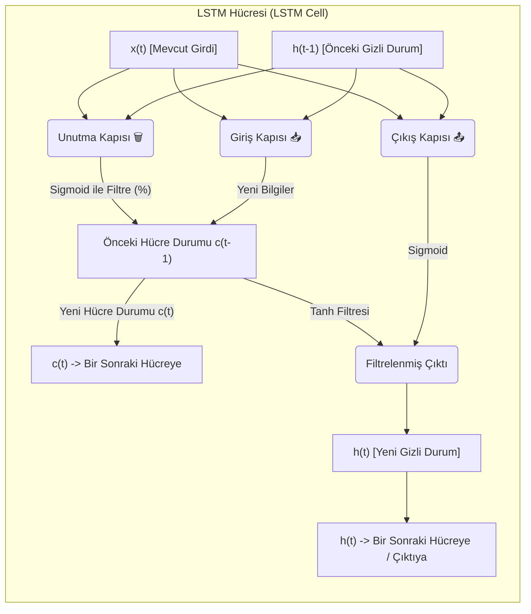
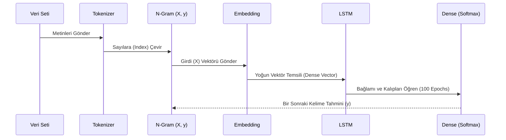

# 🧠 LSTM ile Metin Üretimi (Text Generation with LSTM)


Bu proje, **Long Short-Term Memory (LSTM)** algoritmalarını kullanarak, verilen bir kelime dizisinden yola çıkarak mantıklı ve anlamlı Türkçe cümleler üretilmesini sağlayan bir **Doğal Dil İşleme (NLP)** modelidir.

---

##  Projenin Amacı

Model, bir dizi kelime öbeği alır ve bu dizideki örüntüleri öğrenerek, girilen rastgele bir metne uygun bir şekilde bir sonraki kelimeyi (veya kelimeleri) tahmin eder.

**Örnek:**
> **Girdi:** "bugün hava"
> **Çıktı:** "bugün hava dünküne göre çok daha ılık"

---

## 📊 Veri Seti

Projede, günlük hayatta kullanılan yapılar ve kelimeler üzerine odaklanmış **ortalama 200 cümlelik Türkçe bir veri seti** (ChatGPT ile üretilmiştir) kullanılmaktadır. Bu kısıtlı ama çeşitli veri kümesi sayesinde model, cümle yapılarını ve kelime ardışıklığını (n-gram) öğrenmektedir.

---

##  LSTM (Uzun-Kısa Vadeli Hafıza) Nedir?

**LSTM**, Geleneksel Tekrarlayan Sinir Ağlarının (RNN - Recurrent Neural Networks) karşılaştığı **"Kaybolan Gradyan" (Vanishing Gradient)** problemini çözmek amacıyla geliştirilmiş özel bir RNN mimarisidir. 

RNN'ler, dizisel (sequential) verileri işlerken eski bilgilere ulaşmakta zorlanır. LSTM ise içindeki karmaşık kapı mekanizmaları (Gate Mechanisms) sayesinde uzun vadeli bağımlılıkları öğrenme ve hatırlama konusunda son derece başarılıdır.

### 🏗️ LSTM Hücresi ve Kapı Mekanizmaları

Bir LSTM hücresi temel olarak 3 ana kapıdan (gate) oluşur:
1. **Unutma Kapısı (Forget Gate):** Hangi bilgilerin hücre durumundan (cell state) atılacağına karar verir.
2. **Giriş Kapısı (Input Gate):** Hücre durumuna hangi yeni bilgilerin ekleneceğini belirler.
3. **Çıkış Kapısı (Output Gate):** Hücrenin bir sonraki gizli duruma (hidden state) hangi bilgileri aktaracağına karar verir.



### 🧠 Ağın Çalışma Prensibi

Projedeki model mimarisi aşağıdaki adımları izler:

1. **Tokenization:** Metin dizilerini sayısal (index) forma çevirir.
2. **N-Gram Dizileri:** Her kelimenin kendinden önceki dizilerle birleştiği n-gram vektörleri oluşturur.
3. **Padding:** Modelin sabit boyutta girdiler alabilmesi için diziler aynı uzunluğa (sıfırlarla) tamamlanır (pre-padding).
4. **Embedding Katmanı:** Kelime indeksleri düşük ve yoğun boyutlu vektörlere dönüştürülür.
5. **LSTM Katmanı:** Cümle içindeki anlamsal bağımlılıkları öğrenir. (Projemizde 100 hücrelik bir LSTM katmanı vardır.)
6. **Dense (Softmax) Katmanı:** Kelime hazinesindeki tüm kelimeler üzerinden "Sıradaki Kelimenin Olasılık Dağılımını" üretir.



---

## 💻 Kurulum ve Kullanım

### Gereksinimler
Projenin çalışması için temel olarak Python 3.x ortamına ve TensorFlow kütüphanesine ihtiyacın var. Bağımlılıkları yüklemek için:

```bash
pip install -r requirement.txt
```

### Modeli Eğitmek ve Metin Üretmek
Terminal (veya komut satırı) üzerinden `train_lstm.py` dosyasını çalıştırın:

```bash
python train_lstm.py
```

Dosya çalıştığında model eğitime başlayacaktır. Eğitim bittikten sonra örnek cümleler üreterek terminale yazdıracaktır. Örnek çıktılar:

- `ben yarin` $\rightarrow$ `ben yarin sonu için kendime gülümsedim çok`
- `bugün hava` $\rightarrow$ `bugün hava dünküne göre çok daha ılık`
- `akşam yemeğinde` $\rightarrow$ `akşam yemeğinde taze fasulye ve yanına pilav`

---

## 🤝 Geliştirme ve Katkı
Bu proje NLP ve Derin Öğrenme temellerini öğrenmek amacıyla geliştirilmiştir. Daha büyük veri setleri ile (örneğin Wikipedia dump statik veya film yorumları verisi) katmanlar (Birden çok LSTM katmanı, Dropout) artırılarak çok daha kreatif cümleler üretmesi sağlanabilir.
